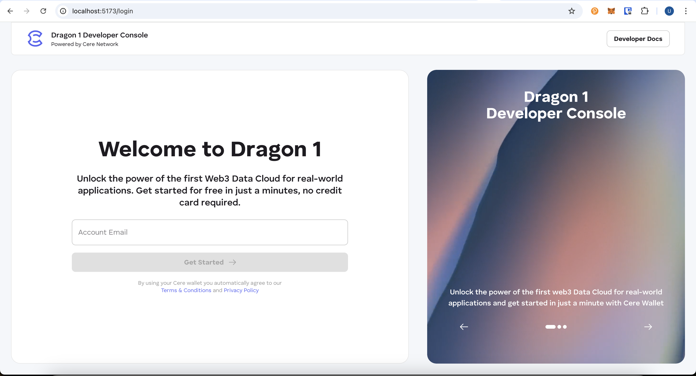

# Developer Console

- [Project structure](./STRUCTURE.md)

- Start application
1. Install dependencies:

  ```
  npm i
  ```

2. Copy ENV file:

 ```
 cp .env.stage .env
 ```

3. Run an application:

 ```
 npm run start -w apps/developer-console
 ```

4. Open http://localhost:5173/
- You should be able to see Welcome page

  
