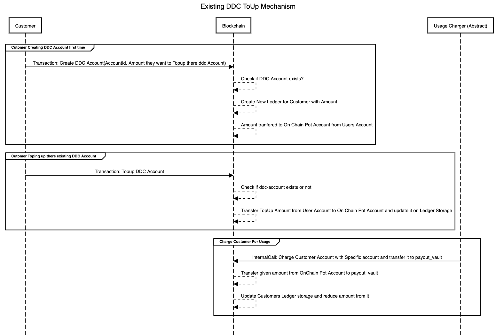
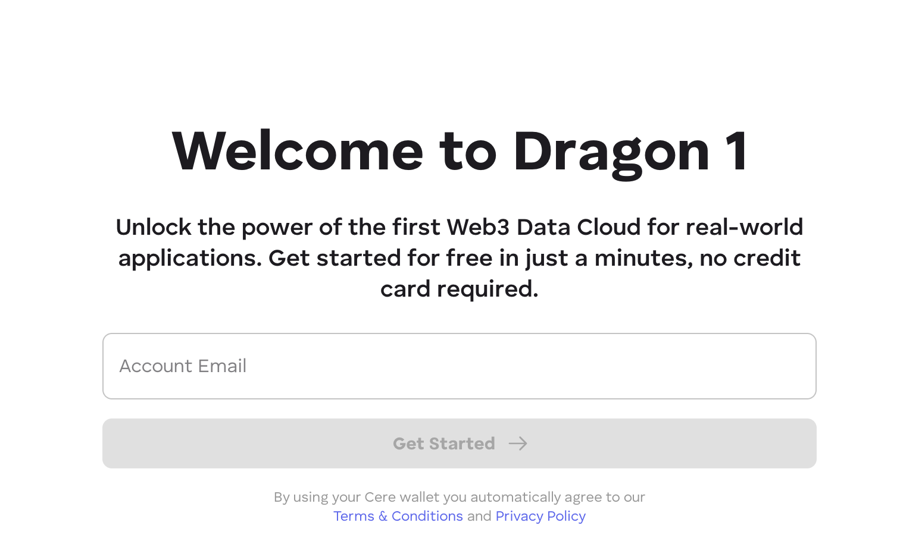
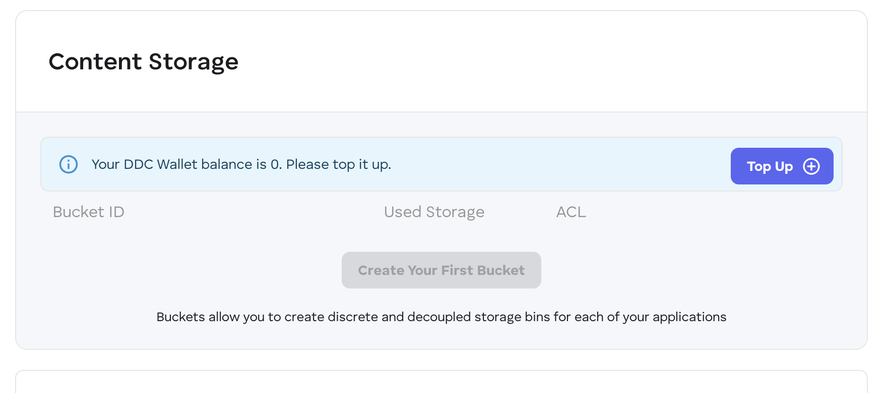
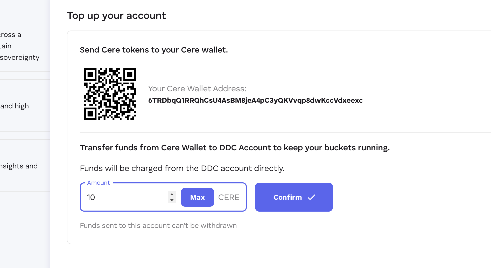

# Developer Console USDC / Fiat Onboarding Idea 🚀

This document outlines the details of the program, including its objectives, challenges, proposed solutions, deliverables, and resources. Below is the index for easy navigation:

---

## 📚 Index
1. [Introduction](#introduction)
2. [Objective](#objective)
3. [Key Concepts/Keywords](#key-conceptskewords)
4. [Existing System and Challenges](#existing-system-and-challenges)
5. [Top-Up DDC Account Manually (Exercise)](#top-up-ddc-account-manually-exercise)
6. [Key Features](#key-features)
7. [Benefits](#benefits)
8. [Deliverables](#deliverables)
9. [Resources](#resources)
10. [Application Process](#application-process)

---

## **Introduction** 🌟
Using Cere Network's Decentralized Data Cluster (DDC) infrastructure requires the user to convert CERE tokens into DDC Credits. These credits are essential to pay for storage, data retrival and computations.
To top up a DDC accounts, the user must first add CERE tokens to their wallet. If they do not have CERE tokens, they need to purchase or swap them through external services. These extra steps can create friction in the user onboarding process.

The goal for this RFP is to create a solution that makes the process seamless by enabling users to directly top up their account with DDC Credits using fiat currencies like USD or EUR, or cryptocurrencies such as USDT or USDC. This streamlined approach simplifies the onboarding process and enhances accessibility for new users within the Cere ecosystem.

---

## **Objective** 🎯
The goal of this initiative is to improve the **Developer Console UI** by enabling users to directly top up their **DDC wallets** using fiat currencies (e.g., 💵 USD) or cryptocurrencies like **USDC/USDT** on EVM-based networks. This feature aims to:
- ✅ Simplify the onboarding process for developers.
- ✅ Reduce reliance on external services for acquiring CERE tokens.

**Budget:**
Up to 2.000 USDT

---

## **Key Concepts/Keywords** 📝
- **DDC (Decentralized Data Cluster):** Blockchain-based storage solution.
- **On-Ramp Provider:** Service enabling fiat-to-crypto conversion.
- **Fiat:** Government-issued currency like USD.
- **USDC/USDT:** Stablecoins pegged to USD.

---

## **Existing System and Challenges** ⚙️

### Existing System 🔄
The current DDC top-up mechanism involves the following processes, as illustrated in the diagram:

1. **Creating a DDC Account for the First Time**:
   - Customers initiate a transaction to create their DDC account by specifying the account ID and the initial amount they wish to top up.
   - The blockchain checks if the DDC account already exists. If not, a new ledger is created for the customer with the specified amount.
   - The top-up amount is transferred from the user's account to an on-chain pot account, and the ledger storage is updated accordingly.
2. **Topping Up an Existing DDC Account**:
   - Customers perform a transaction to top up their existing DDC accounts.
   - The blockchain verifies whether the DDC account exists. If it does, the top-up amount is transferred from the user's account to the on-chain pot account, and the ledger storage is updated.
3. **Charging for Usage**:
   - An internal call charges the customer's account based on usage and transfers funds to a payout vault.
   - The specified amount is deducted from the on-chain pot account and transferred to the payout vault.
   - The customer's ledger storage is updated, reducing their balance accordingly.

### Challenges 🚧
### 

1. **Dependency on CERE Tokens**:
   - The system requires users to acquire CERE tokens for top-ups, which creates barriers for those unfamiliar with blockchain systems or token acquisition processes. This dependency complicates user onboarding into the Cere ecosystem.
2. **Manual Top-Up Process**:
   - Users must manually monitor their balances and initiate top-ups, increasing the risk of service interruptions due to low or depleted balances. This lack of automation can lead to inefficiencies and disrupt seamless usage.

These challenges highlight areas where improvements are necessary to enhance user experience and streamline access to Cere's infrastructure.

---

## **Top-Up DDC Account Manually (Exercise)** 🛠️
The current process for manually topping up a DDC account involves the following steps:
### Steps:
1. **Sign Up on Developer Console**
    - Users must register on the Developer Console using their email ID to access the platform.
      
2. **Initiate a Top-Up Transaction**
    - After logging in, users click the "Top Up" button within the Developer Console to begin the top-up process.
      
3. **Transfer Funds Manually**
    - Users manually transfer funds from their Cere Wallet to their DDC Account. This step requires users to ensure they have sufficient CERE tokens in their wallet and complete the transaction manually.
      

This manual process introduces inefficiencies, requiring users to actively monitor their balances and perform multiple steps to maintain uninterrupted access to Cere's infrastructure. It also creates friction for onboarding users unfamiliar with blockchain systems.

---

## **Deliverables** 📦

### Deliverable 1: Manual Execution 📝
- Users will manually execute the proposed solution to gain a clear understanding of the process and identify programming requirements.
- **Steps**:
   1. Swap USDT for CERE ERC20 tokens using Uniswap.
   2. Use Hyperbridge to teleport the tokens from the EVM-based network to the Cere Mainnet.
   3. Verify whether the DDC account has been updated with the transferred tokens.
- **Outcome**: Screenshots and detailed observations will be collected during this manual process to ensure clarity on each step.

### Deliverable 2: Programmatic Implementation 💻
- Automate the entire process of token swaps, teleportation, and DDC account updates using smart contracts and APIs.
- **Key Tasks**:
   1. Develop smart contracts to handle token swaps (e.g., USDT to CERE) and teleportation via Hyperbridge.
   2. Integrate fiat-to-USDT conversion functionality using an On-Ramp API for seamless fiat-based top-ups.
   3. Ensure programmatic updates of DDC accounts on the Cere Mainnet.

### Deliverable 3: Polishing and Optimization 🎨
- Fully integrate all functionalities into the Developer Console for a seamless user experience.
- **Key Enhancements**:
   1. Optimize smart contract performance to reduce gas fees and improve transaction speed.
   2. Implement robust error handling mechanisms to manage failures during token swaps, teleportation, or account updates.
   3. Strengthen security measures to protect user funds and data integrity during transactions.
   4. Provide comprehensive documentation for both developers and end-users, including step-by-step guides, API references, and troubleshooting tips.

---


## **Quick Start Guide** 🚀

This guide provides a step-by-step process to set up, run, and analyze the implementation required for the proposed solution. Additionally, it includes the requirements for achieving the smart contract functionality necessary for the solution.

---

### **1. Setting Up Your Environment** 🛠️

1. **Clone the Repository**  
   Clone the project repository to your local machine:
   ```bash  
   git clone https://github.com/Cerebellum-Network/cluster-apps.git  
   ```

2. **Payment Provider Test Accounts**
    - Sign up for a Stripe test account and obtain test API keys by following [Stripe's guide](https://docs.stripe.com/keys).
    - Keep these keys secure and use them only in test mode.

3. **Configure the Project**
    - Clone the Developer Console UI repository.
    - Update configuration files (e.g., `.env`) with your test API keys, ensuring proper setup for test mode.

---

### **2. Running the Base Implementation** ⚙️

1. **Install Dependencies**  
   Navigate to the project directory and install all necessary dependencies:
   ```bash  
   npm install  
   ```
   or
   ```bash  
   yarn install  
   ```

2. **Start the Application**  
   Launch the local server:
   ```bash  
   npm start  
   ```
   or
   ```bash  
   yarn start  
   ```

3. **Test the Base Functionality**
    - Access the Developer Console locally at `http://localhost:3000`.
    - Attempt to top up an account using test payment methods to avoid real transactions.

---

### **3. Analyzing Performance** 📊

1. **Understand Logs**
    - Check application logs for transaction records, focusing on successes and failures.

2. **Blockchain Verification**
    - Use a blockchain explorer like [Etherscan](https://sepolia.etherscan.io/) to verify if USDC deposits are received by the smart contract and correctly mapped to Developer Console accounts.

3. **Calculate Success Rates**  
   Use this formula to calculate success rates:  
   $$
   \text{Success Rate} = \left( \frac{\text{Successful Transactions}}{\text{Total Transactions}} \right) \times 100\%
   $$

4. **User Flow Metrics**  
   Simulate the payment process to identify friction points, noting any error messages or confusing UI elements for improvement.

---

### **4. Optimizing Payment Flow** 🔧

1. **Research Better Approaches**  
   Explore alternative payment providers like Square or Ramp.network for better conversion rates or user experience.

2. **Implement Changes**  
   Fork the code to integrate a new provider or optimize the existing one, ensuring testing with test API keys.

3. **Test and Verify**  
   Run the application, test the new flow, and analyze logs to check for improved conversion rates, tracking changes in success rates and user feedback.

---

### **5. Requirements for Smart Contracts Implementation** 🔒

To achieve the proposed solution of enabling fiat and cryptocurrency-based top-ups with automated token conversion and cross-chain functionality, follow these requirements:

#### 1️⃣ **Smart Contract Features**
- Develop a smart contract that supports:
    - Conversion of USDT/USDC into CERE tokens using decentralized exchanges like Uniswap.
    - Mapping of converted tokens to user DDC accounts on the Cere Mainnet.
    - Cross-chain teleportation of tokens from EVM-based networks (e.g., Ethereum) to Cere Mainnet using Hyperbridge technology.

#### 2️⃣ **Token Swap Integration**
- Integrate with Uniswap or similar platforms to enable:
    - Automated swapping of USDT/USDC into CERE tokens.
    - Error handling for failed swaps due to insufficient liquidity or price slippage.

#### 3️⃣ **Cross-Chain Teleportation**
- Implement Hyperbridge technology for:
    - Seamless transfer of CERE tokens from EVM-based networks (e.g., Ethereum) to Cere Mainnet.
    - Verification mechanisms to ensure successful teleportation.

#### 3️⃣ **Security Measures**
- Add robust security features such as:
    - Multi-signature wallets for fund management.
    - Reentrancy guards in smart contracts.
    - Input validation for transaction parameters.

#### 3️⃣ **Programmatic Updates**
- Automate updates of user DDC accounts by:
    - Triggering smart contract events upon successful token swaps and teleportation.
    - Updating account balances on Cere Mainnet via APIs.

#### 6️⃣ **Testing and Deployment**
- Deploy contracts on testnets like Goerli or Sepolia before mainnet deployment.
- Test all functionalities, including:
    - Token swaps.
    - Cross-chain teleportation.
    - Account balance updates.

---

## **Resources** 📚
- Dev Console: [https://stage.developer.console.cere.network/](https://stage.developer.console.cere.network/)
- Cere Wallet Client: [GitHub Link](https://github.com/cere-io/cere-wallet-client)
- Cere Wallet SDK: [GitHub Link](https://github.com/cere-io/cere-wallet-client/tree/dev/packages/embed-wallet)
- Cere Wallet API: [GitHub Link](https://github.com/cere-io/cere-wallet-api)
- Testnet Details:
    - Developer Console: [https://stage.developer.console.cere.network/](https://stage.developer.console.cere.network/)
    - Cere Wallet: [https://wallet.stg.cere.io/wallet/home](https://wallet.stg.cere.io/wallet/home)

## **Application Process**

### Choose Idea OR Come with your Idea
Click  [here](ideas%2Fopen_ideas.md) for open ideas.

### Application Submission
1. Fork [this repository](https://github.com/Cerebellum-Network/grant-program) (branch: `master`)  or `git pull` to update your existing repo.
2. Create a new branch called `Grant App - Project Name`.
3. Create a copy of the `application_template.md` file in the `applications/` directory of your newly created fork.
4. Name the new file after your project: `project_name.md`.
5. Fill out the template with the details of your project.
   💡 That file should contain ALL necessary information for complete evaluation of the proposed grant! And the more information, the faster the review.
6. Review the `Terms and Conditions` file inside the Documents folder.
7. Once you're done, create a pull request.

   ⚠️ By initiating a pull request, you are indicating you have ready and accepted the terms and conditions as provided.

8. At this stage, the pull request should only contain *one new file* — the markdown file you created from the template.

### Application Review
1. The Cere Foundation Grants Committee will issue comments and request changes on the pull request.
2. Clarifications and amendments made in the comments need to be included in the application. You may address feedback by modifying your application directly and leaving a comment once you're done.
3. The application is accepted when all requested changes are addressed, and the terms and conditions have been agreed upon.
4. The application will be subject to automatic rejection after 2 weeks of inactivity.
   Unless specified otherwise, the day on which it is accepted will be considered the starting date of the project, and will be used to estimate delivery dates.

### Onboarding
We will review the application and provide the further instruction.

---
