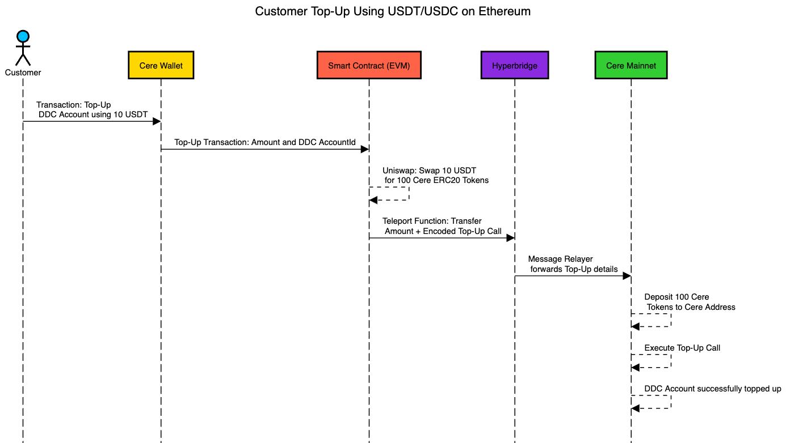
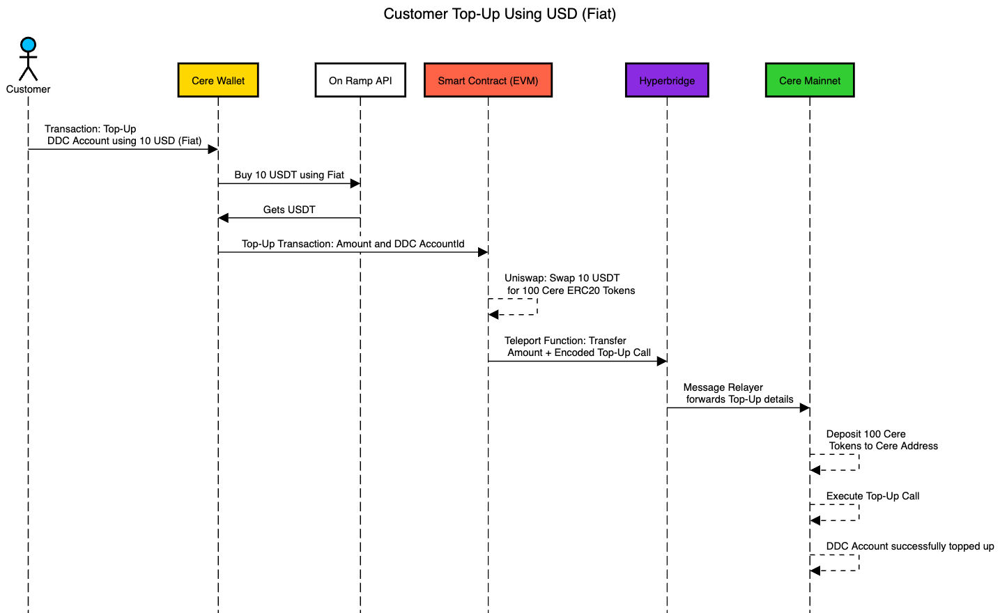

# README for Grant Program 🚀

Welcome to the **Grant Program**! This document outlines the details of the program, including its objectives, challenges, proposed solutions, deliverables, and resources. Below is the index for easy navigation:

---

## 📚 Index
1. [Introduction](#introduction)
2. [Objective](#objective)
3. [Key Concepts/Keywords](#key-conceptskewords)
4. [Existing System and Challenges](#existing-system-and-challenges)
5. [Top-Up DDC Account Manually (Exercise)](#top-up-ddc-account-manually-exercise)
6. [Proposed Solution](#proposed-solution)
7. [Key Features](#key-features)
8. [Benefits](#benefits)
9. [Deliverables](#deliverables)
10. [Resources](#resources)

---

## **Introduction** 🌟
Using Cere Network's Decentralized Data Cluster (DDC) infrastructure requires the user to convert CERE tokens into DDC Credits. These credits are essential to pay for storage, data retrival and computations.
To top up a DDC accounts, the user must first add CERE tokens to their wallet. If they do not have CERE tokens, they need to purchase or swap them through external services. These extra steps can create friction in the user onboarding process.

The goal for this RFP is to create a solution that makes the process seamless by enabling users to directly top up their account with DDC Credits using fiat currencies like USD or EUR, or cryptocurrencies such as USDT or USDC. This streamlined approach simplifies the onboarding process and enhances accessibility for new users within the Cere ecosystem.

---

## **Objective** 🎯
The primary objective of this initiative is to enhance the Developer Console UI by enabling users to directly top up their DDC wallets using fiat currencies like USD or cryptocurrencies such as USDC/USDT on EVM-based networks. This improvement aims to streamline the onboarding process and reduce dependency on external services for acquiring CERE tokens.

---

## **Key Concepts/Keywords** 📝
- **DDC (Decentralized Data Cluster):** Blockchain-based storage solution.
- **On-Ramp Provider:** Service enabling fiat-to-crypto conversion.
- **Fiat:** Government-issued currency like USD.
- **USDC/USDT:** Stablecoins pegged to USD.

---

## **Existing System and Challenges** ⚙️

### Existing System 🔄
The current DDC top-up mechanism involves the following processes, as illustrated in the diagram:

1. **Creating a DDC Account for the First Time**:
   - Customers initiate a transaction to create their DDC account by specifying the account ID and the initial amount they wish to top up.
   - The blockchain checks if the DDC account already exists. If not, a new ledger is created for the customer with the specified amount.
   - The top-up amount is transferred from the user's account to an on-chain pot account, and the ledger storage is updated accordingly.
2. **Topping Up an Existing DDC Account**:
   - Customers perform a transaction to top up their existing DDC accounts.
   - The blockchain verifies whether the DDC account exists. If it does, the top-up amount is transferred from the user's account to the on-chain pot account, and the ledger storage is updated.
3. **Charging for Usage**:
   - An internal call charges the customer's account based on usage and transfers funds to a payout vault.
   - The specified amount is deducted from the on-chain pot account and transferred to the payout vault.
   - The customer's ledger storage is updated, reducing their balance accordingly.

### Challenges 🚧
### 

1. **Dependency on CERE Tokens**:
   - The system requires users to acquire CERE tokens for top-ups, which creates barriers for those unfamiliar with blockchain systems or token acquisition processes. This dependency complicates user onboarding into the Cere ecosystem.
2. **Manual Top-Up Process**:
   - Users must manually monitor their balances and initiate top-ups, increasing the risk of service interruptions due to low or depleted balances. This lack of automation can lead to inefficiencies and disrupt seamless usage.

These challenges highlight areas where improvements are necessary to enhance user experience and streamline access to Cere's infrastructure.

---

## **Top-Up DDC Account Manually (Exercise)** 🛠️
The current process for manually topping up a DDC account involves the following steps:
### Steps:
1. **Sign Up on Developer Console**
    - Users must register on the Developer Console using their email ID to access the platform.
      
2. **Initiate a Top-Up Transaction**
    - After logging in, users click the "Top Up" button within the Developer Console to begin the top-up process.
      
3. **Transfer Funds Manually**
    - Users manually transfer funds from their Cere Wallet to their DDC Account. This step requires users to ensure they have sufficient CERE tokens in their wallet and complete the transaction manually.
      

This manual process introduces inefficiencies, requiring users to actively monitor their balances and perform multiple steps to maintain uninterrupted access to Cere's infrastructure. It also creates friction for onboarding users unfamiliar with blockchain systems.

---

## **Proposed Solution** 💡
# 

The proposed solution aims to simplify and enhance the DDC account top-up process by allowing users to directly top up their accounts using fiat currencies (e.g., USD or EUR) or cryptocurrencies (e.g., USDT or USDC) on EVM-based networks. This approach removes the dependency on manual token acquisition and streamlines onboarding for users unfamiliar with blockchain systems.
### Sequence Diagrams

### **Key Features** ✨

1. **Fiat-Based Top-Up**:
   - Users can directly top up their DDC accounts using fiat currencies like USD through an integrated On-Ramp API.
   - The system will convert fiat to USDT/USDC and then swap it for CERE tokens.
2. **Cryptocurrency-Based Top-Up**:
   - Users can utilize cryptocurrencies such as USDT or USDC to top up their DDC accounts.
   - Smart contracts will handle the swap of USDT/USDC for CERE tokens and execute the top-up transaction.
3. **Automated Token Conversion**:
   - The solution integrates with platforms like Uniswap to facilitate automatic swapping of fiat or cryptocurrency into CERE tokens.
4. **Cross-Chain Functionality**:
   - Hyperbridge technology will enable seamless transfer of CERE tokens from EVM-based networks to the Cere Mainnet.
5. **Enhanced User Experience**:
   - The Developer Console UI will be upgraded to allow users to initiate top-up transactions in just a few clicks, ensuring a smooth and intuitive process.

### **Benefits**

1. Simplifies onboarding by eliminating the need for manual CERE token acquisition.
2. Reduces service interruptions caused by low balances through automated processes.
3. Enhances accessibility by supporting fiat currencies and popular cryptocurrencies for top-ups.
4. Improves user experience with a streamlined and user-friendly interface.
5. Encourages broader adoption of the Cere ecosystem by lowering entry barriers for non-technical users.

This proposed solution ensures a more efficient, accessible, and user-friendly process for topping up DDC accounts, fostering broader adoption of Cere's infrastructure.

## **Deliverables** 📦

### Deliverable 1: Manual Execution 📝
- Users will manually execute the proposed solution to gain a clear understanding of the process and identify programming requirements.
- **Steps**:
   1. Swap USDT for CERE ERC20 tokens using Uniswap.
   2. Use Hyperbridge to teleport the tokens from the EVM-based network to the Cere Mainnet.
   3. Verify whether the DDC account has been updated with the transferred tokens.
- **Outcome**: Screenshots and detailed observations will be collected during this manual process to ensure clarity on each step.

### Deliverable 2: Programmatic Implementation 💻
- Automate the entire process of token swaps, teleportation, and DDC account updates using smart contracts and APIs.
- **Key Tasks**:
   1. Develop smart contracts to handle token swaps (e.g., USDT to CERE) and teleportation via Hyperbridge.
   2. Integrate fiat-to-USDT conversion functionality using an On-Ramp API for seamless fiat-based top-ups.
   3. Ensure programmatic updates of DDC accounts on the Cere Mainnet.

### Deliverable 3: Polishing and Optimization 🎨
- Fully integrate all functionalities into the Developer Console for a seamless user experience.
- **Key Enhancements**:
   1. Optimize smart contract performance to reduce gas fees and improve transaction speed.
   2. Implement robust error handling mechanisms to manage failures during token swaps, teleportation, or account updates.
   3. Strengthen security measures to protect user funds and data integrity during transactions.
   4. Provide comprehensive documentation for both developers and end-users, including step-by-step guides, API references, and troubleshooting tips.

---

## **Resources** 📚
- Dev Console: [https://stage.developer.console.cere.network/](https://stage.developer.console.cere.network/)
- Cere Wallet Client: [GitHub Link](https://github.com/cere-io/cere-wallet-client)
- Cere Wallet SDK: [GitHub Link](https://github.com/cere-io/cere-wallet-client/tree/dev/packages/embed-wallet)
- Cere Wallet API: [GitHub Link](https://github.com/cere-io/cere-wallet-api)
- Testnet Details:
    - Developer Console: [https://stage.developer.console.cere.network/](https://stage.developer.console.cere.network/)
    - Cere Wallet: [https://wallet.stg.cere.io/wallet/home](https://wallet.stg.cere.io/wallet/home)

---