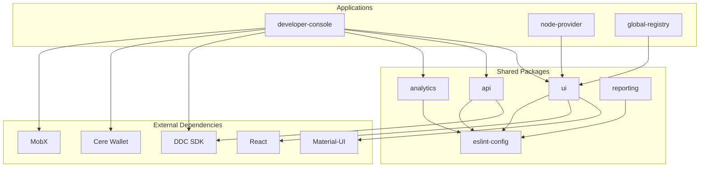

# Module Architecture

## Overview

Cluster Apps follows a modular monorepo architecture with npm workspaces. This document details the structure, dependencies, and relationships between all modules.

## Workspace Configuration

The monorepo is configured with npm workspaces in `package.json`:

```json
{
  "workspaces": [
    "packages/*",
    "apps/*"
  ]
}
```

## Applications

### Developer Console (`apps/developer-console`)

**Purpose**: Primary interface for developers to manage DDC resources

**Key Features**:
- Content Storage management
- Content Delivery Network (CDN) setup
- Activity Capture configuration
- User onboarding and quest system
- Wallet integration

**Architecture**:
```
src/
├── applications/          # Modular applications
│   ├── ContentStorage/   # File storage management
│   ├── ContentDelivery/  # CDN configuration
│   └── ActivityCapture/  # Event tracking setup
├── stores/               # MobX state management
│   ├── AppStore/        # Root application state
│   ├── AccountStore/    # User account management
│   ├── OnboardingStore/ # User onboarding flow
│   └── QuestsStore/     # Achievement system
├── routes/              # React Router configuration
├── components/          # Reusable components
└── hooks/              # Custom React hooks
```

**Dependencies**:
- `@cere-ddc-sdk/blockchain`: Blockchain operations
- `@cere-ddc-sdk/ddc-client`: DDC cluster interactions
- `@cere/embed-wallet`: Wallet integration
- `mobx`: State management
- `react`: UI framework
- `react-router-dom`: Navigation
- `@cluster-apps/ui`: Shared UI components
- `@cluster-apps/api`: API utilities
- `@cluster-apps/analytics`: User tracking

### Node Provider Console (`apps/node-provider`)

**Purpose**: Management interface for DDC node operators

**Key Features**:
- Node deployment automation
- Monitoring and metrics collection
- Docker container management
- Grafana agent configuration

**Architecture**:
```
src/
├── components/          # Node management UI
├── services/           # Node operation services
└── utils/             # Utility functions

Bootstrap Files:
├── bootstrap.sh        # Node setup script
├── docker-compose.yml  # Container orchestration
└── agent-config.yaml   # Monitoring configuration
```

**Dependencies**:
- `@cluster-apps/ui`: Shared UI components
- Docker & Docker Compose (runtime)
- Grafana Agent (monitoring)

### Global Registry (`apps/global-registry`)

**Purpose**: Global access management for DDC clusters

**Key Features**:
- Cluster-wide access control
- Permission management
- Global configuration

**Architecture**:
```
src/
├── components/          # Registry management UI
├── services/           # Registry operations
└── utils/             # Utility functions
```

**Dependencies**:
- `@cluster-apps/ui`: Shared UI components

## Shared Packages

### UI Package (`packages/ui`)

**Purpose**: Reusable Material-UI based components

**Features**:
- Consistent design system
- DDC-specific components
- Charts and data visualization
- Markdown rendering
- QR code generation

**Key Components**:
```typescript
// Example component structure
export { Button } from './Button';
export { DataTable } from './DataTable';
export { FileUpload } from './FileUpload';
export { WalletConnect } from './WalletConnect';
export { ProgressChart } from './charts/ProgressChart';
```

**Dependencies**:
- `@mui/material`: Material-UI components
- `@mui/icons-material`: Material-UI icons
- `@mui/x-charts`: Chart components
- `react-markdown`: Markdown rendering
- `react-qr-code`: QR code generation
- `lottie-react`: Animation support

### API Package (`packages/api`)

**Purpose**: HTTP client and API abstractions

**Features**:
- Axios-based HTTP client
- API endpoint management
- Request/response interceptors
- Error handling utilities

**Structure**:
```typescript
// API client structure
export class ApiClient {
  constructor(baseURL: string);
  get<T>(url: string): Promise<T>;
  post<T>(url: string, data: any): Promise<T>;
  // ... other HTTP methods
}

export const ddcApi = new ApiClient(DDC_API_URL);
export const indexerApi = new ApiClient(INDEXER_URL);
```

**Dependencies**:
- `axios`: HTTP client library

### Analytics Package (`packages/analytics`)

**Purpose**: User tracking and analytics

**Features**:
- Event tracking
- User journey analytics
- Performance metrics
- Custom analytics events

**Structure**:
```typescript
// Analytics interface
export interface AnalyticsProvider {
  track(event: string, properties?: any): void;
  identify(userId: string, traits?: any): void;
  page(name: string, properties?: any): void;
}

export const analytics: AnalyticsProvider;
```

### Reporting Package (`packages/reporting`)

**Purpose**: Data reporting utilities

**Features**:
- Report generation
- Data export utilities
- Formatting helpers

**Structure**:
```typescript
// Reporting utilities
export class ReportGenerator {
  generateCSV(data: any[]): string;
  generateJSON(data: any[]): string;
  exportFile(content: string, filename: string): void;
}
```

### ESLint Config Package (`packages/eslint-config`)

**Purpose**: Shared linting configuration

**Features**:
- TypeScript support
- React-specific rules
- Prettier integration
- Custom rules for DDC development

**Configuration**:
```json
{
  "extends": [
    "@typescript-eslint/recommended",
    "plugin:react/recommended",
    "plugin:react-hooks/recommended",
    "prettier"
  ],
  "plugins": ["@typescript-eslint", "react", "react-hooks"],
  "rules": {
    // Custom rules
  }
}
```

## Dependency Graph

### Application Dependencies



### Package Interdependencies

| Package | Depends On | Used By |
|---------|------------|---------|
| `eslint-config` | ESLint, TypeScript | All packages |
| `ui` | MUI, React, `eslint-config` | All applications |
| `api` | Axios, `eslint-config` | `developer-console` |
| `analytics` | `eslint-config` | `developer-console` |
| `reporting` | `eslint-config` | `developer-console` |

## Build System

### TypeScript Configuration

Root `tsconfig.json` provides shared configuration:

```json
{
  "compilerOptions": {
    "target": "ES2020",
    "lib": ["ES2020", "DOM", "DOM.Iterable"],
    "module": "ESNext",
    "moduleResolution": "bundler",
    "jsx": "react-jsx",
    "strict": true,
    "paths": {
      "~/*": ["${configDir}/src/*"],
      "@cluster-apps/*": ["./packages/*/src"]
    }
  }
}
```

### Vite Configuration

Each application has its own Vite configuration:

```typescript
// apps/developer-console/vite.config.ts
import { defineConfig } from 'vite';
import react from '@vitejs/plugin-react';
import { nodePolyfills } from 'vite-plugin-node-polyfills';

export default defineConfig({
  plugins: [
    react(),
    nodePolyfills() // For DDC SDK compatibility
  ],
  // ... other configuration
});
```

## Module Loading

### Path Mapping

TypeScript path mapping allows clean imports:

```typescript
// Import from shared packages
import { Button } from '@cluster-apps/ui';
import { ApiClient } from '@cluster-apps/api';

// Import from app-specific modules
import { HomeRoute } from '~/routes/Home';
import { AppStore } from '~/stores/AppStore';
```

### Dynamic Imports

Applications use dynamic imports for code splitting:

```typescript
// Lazy loading applications
const ContentStorage = lazy(() => import('./applications/ContentStorage'));
const ContentDelivery = lazy(() => import('./applications/ContentDelivery'));
const ActivityCapture = lazy(() => import('./applications/ActivityCapture'));
```

## Package Management

### Workspace Commands

```bash
# Install dependencies for all workspaces
npm install

# Run command in specific workspace
npm run build -w apps/developer-console

# Run command in all workspaces
npm run build --workspaces

# Add dependency to specific workspace
npm install react -w apps/developer-console
```

### Shared Dependencies

Common dependencies are defined at the root level:

```json
{
  "dependencies": {
    "react": "^18.3.1",
    "react-dom": "^18.3.1",
    "typescript": "^5.5.3"
  }
}
```

## Version Management

### Semantic Versioning

All packages follow semantic versioning:
- `major.minor.patch`
- Breaking changes increment major version
- New features increment minor version
- Bug fixes increment patch version

### Release Process

1. Update version in `package.json`
2. Update `CHANGELOG.md`
3. Create git tag
4. Deploy to respective environments

## Extension Points

### Adding New Applications

1. Create new directory in `apps/`
2. Add package.json with workspace configuration
3. Configure TypeScript and Vite
4. Add to root scripts if needed

### Adding New Packages

1. Create new directory in `packages/`
2. Add package.json with proper exports
3. Update dependent applications
4. Add to build and test scripts

### Modifying Dependencies

1. Update package.json in relevant workspace
2. Update TypeScript paths if needed
3. Update documentation
4. Test across all dependent packages

See [Extension Guide](../extension/guide.md) for detailed implementation instructions. 