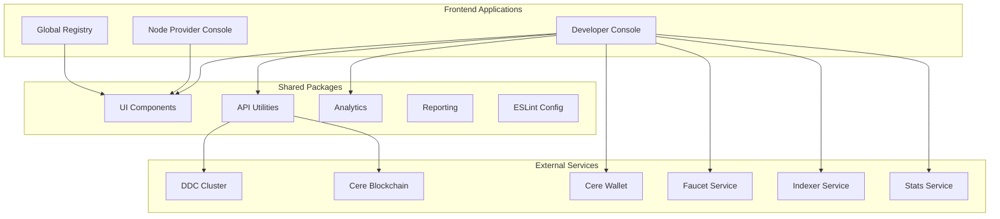
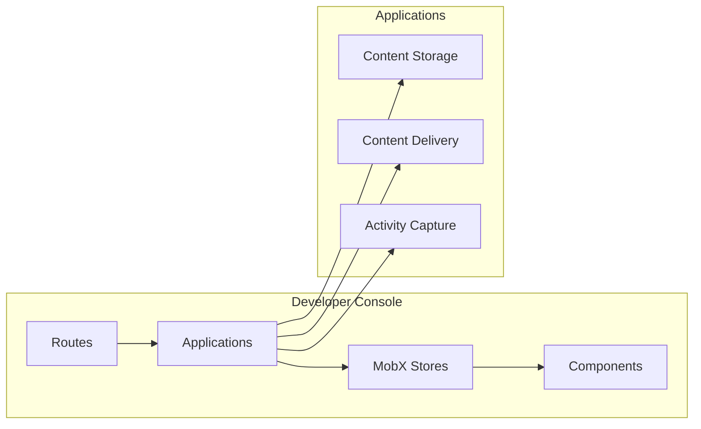
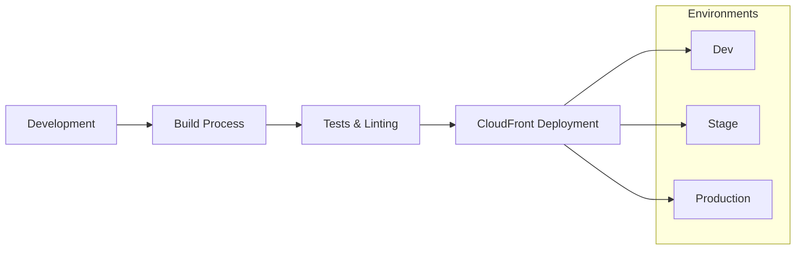
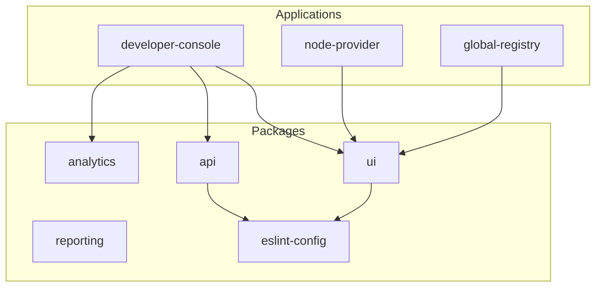

# System Architecture

## Overview

Cluster Apps is a monorepo of web applications designed to manage and interact with DDC (Decentralized Data Cloud) clusters. The system follows a modular architecture with shared packages and independent applications.

## High-Level Architecture



## DDC Integration

### Core Components

1. **DDC SDK Integration**
   - Primary integration through `@cere-ddc-sdk/ddc-client`
   - Blockchain operations via `@cere-ddc-sdk/blockchain`
   - Network presets for devnet, testnet, and mainnet

2. **Data Flow**
   ```
   User Action → Store (MobX) → DDC SDK → DDC Cluster
                                      ↓
   UI Component ← Store Update ← Response
   ```

### Network Configuration

The system supports multiple DDC networks:

- **Devnet**: Development and testing
- **Testnet**: Pre-production testing
- **Mainnet**: Production environment

Configuration is environment-driven through Vite environment variables.

## Application Architecture

### Developer Console



### Modular Application Design

Each application within Developer Console follows a consistent pattern:

1. **Application Definition**
   - Configuration and metadata
   - Feature flags and permissions
   - Navigation and routing

2. **Store Integration**
   - MobX reactive state management
   - DDC SDK integration
   - Error handling and logging

3. **Component Architecture**
   - Reusable UI components
   - Application-specific components
   - Shared package integration

## State Management Architecture

### MobX Store Structure

```typescript
// Core store pattern used across applications
class ApplicationStore {
  // Observable state
  @observable data: DataType[] = [];
  @observable loading = false;
  @observable error: Error | null = null;
  
  // Actions
  @action async fetchData() {
    this.loading = true;
    try {
      const result = await ddcClient.getData();
      this.data = result;
    } catch (error) {
      this.error = error;
    } finally {
      this.loading = false;
    }
  }
}
```

### Store Hierarchy

- **AppStore**: Root application state
- **AccountStore**: User authentication and wallet
- **OnboardingStore**: User onboarding flow
- **QuestsStore**: Achievement and quest system

## Build and Deployment Architecture

### Build System

- **Vite**: Fast build tool with HMR
- **TypeScript**: Type safety and developer experience
- **Workspaces**: Monorepo dependency management

### Deployment Pipeline



## Security Architecture

### Authentication Flow

1. **Wallet Connection**: Cere Wallet integration
2. **Account Verification**: Blockchain account validation
3. **Session Management**: Client-side session handling

### Data Security

- All DDC operations use encrypted channels
- Private keys managed by Cere Wallet
- Environment-specific API endpoints

## Monitoring and Observability

### Error Tracking

- **Sentry Integration**: Real-time error monitoring
- **Custom Error Boundaries**: React error handling
- **DDC Error Context**: Enhanced DDC-specific error information

### Analytics

- **User Tracking**: Custom analytics events
- **Performance Monitoring**: Build and runtime metrics
- **Feature Usage**: Application-specific metrics

## Scalability Considerations

### Horizontal Scaling

- **Static Assets**: CDN distribution via CloudFront
- **API Calls**: Distributed across multiple DDC nodes
- **State Management**: Client-side reactive stores

### Performance Optimization

- **Code Splitting**: Application-level splitting
- **Lazy Loading**: Component and route-based loading
- **Caching**: Browser and CDN caching strategies

## Integration Points

### External APIs

| Service | Purpose | Environment Variable |
|---------|---------|---------------------|
| DDC Storage Node | Data storage/retrieval | `VITE_DDC_STORAGE_NODE_URL` |
| Indexer | Blockchain data queries | `VITE_INDEXER_ENDPOINT` |
| Faucet | Token distribution | `VITE_FAUCET_ENDPOINT` |
| Stats Service | Cluster statistics | `VITE_STATS_ENDPOINT` |
| Cluster Management | Node management | `VITE_CLUSTER_MANAGEMENT_ENDPOINT` |

### Blockchain Integration

- **Network**: Cere Network
- **Wallet**: Embedded Cere Wallet
- **Transactions**: Account and bucket management
- **Tokens**: CERE token handling

## Development Architecture

### Monorepo Structure

```
cluster-apps/
├── .github/workflows/     # CI/CD pipelines
├── apps/                  # Applications
├── packages/             # Shared packages
├── docs/                 # Documentation
└── [config files]       # Root configuration
```

### Package Dependencies



See [Module Architecture](modules.md) for detailed package and dependency information.

## Future Architecture Considerations

### Planned Enhancements

- **Micro-frontend Architecture**: Independent deployments
- **Server-Side Rendering**: Improved SEO and performance
- **Progressive Web App**: Enhanced mobile experience
- **Real-time Updates**: WebSocket integration for live data

### Extensibility

The architecture supports:
- New application additions
- Custom DDC integrations
- Third-party service integrations
- Plugin-based extensions

See [Extension Guide](../extension/guide.md) for implementation details. 