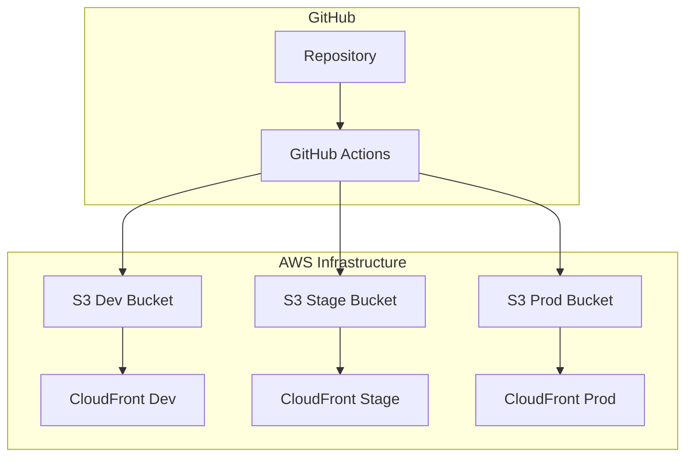

# Deployment Guide

This guide covers the deployment processes, CI/CD pipelines, and environment management for Cluster Apps.

## Overview

Cluster Apps uses a multi-environment deployment strategy with automated CI/CD pipelines:

- **Development**: Continuous deployment from `dev` branch
- **Staging**: Continuous deployment from `stage` branch  
- **Production**: Continuous deployment from `master` branch

## Deployment Architecture

### Infrastructure



### Deployment Targets

| Environment | Branch | S3 Bucket | CloudFront | Purpose |
|-------------|--------|-----------|------------|---------|
| Development | `dev` | `cluster-apps-dev.cere.network` | Auto-deployed | Development testing |
| Staging | `stage` | `cluster-apps-stage.cere.network` | Auto-deployed | Pre-production testing |
| Production | `master` | `cluster-apps-prod.cere.network` | Auto-deployed | Live production |

## CI/CD Pipelines

### GitHub Actions Workflows

#### Development Deployment (`.github/workflows/dev.yaml`)

```yaml
name: Release to dev
on:
  push:
    branches:
      - dev
  workflow_dispatch:

permissions:
  id-token: write
  contents: read

jobs:
  build_and_deploy:
    uses: Cerebellum-Network/reusable-workflows/.github/workflows/deploy-to-cloudfront.yaml@master
    with:
      build_container: 'node:18-buster'
      install_packages_command: 'cp .env.dev .env; npm ci'
      build_command: 'npm run build'
      path_to_static_files_to_upload: 'dist'
      aws_account_id: ${{ vars.DEV_NETWORK_AWS_ACCOUNT_ID }}
      s3_bucket_name: 'cluster-apps-dev.cere.network'
    secrets:
      NPM_TOKEN: ${{ secrets.NPM_TOKEN_READ }}
```

**Triggers**:
- Push to `dev` branch
- Manual workflow dispatch

**Process**:
1. Checkout code
2. Setup Node.js 18
3. Copy dev environment configuration
4. Install dependencies
5. Build applications
6. Deploy to S3 development bucket
7. Invalidate CloudFront cache

#### Staging Deployment (`.github/workflows/stage.yaml`)

```yaml
name: Release to stage
on:
  push:
    branches:
      - stage
  workflow_dispatch:

permissions:
  id-token: write
  contents: read

jobs:
  build_and_deploy:
    uses: Cerebellum-Network/reusable-workflows/.github/workflows/deploy-to-cloudfront.yaml@master
    with:
      build_container: 'node:18-buster'
      install_packages_command: 'cp .env.stage .env; npm ci'
      build_command: 'npm run build'
      path_to_static_files_to_upload: 'dist'
      aws_account_id: ${{ vars.STAGE_NETWORK_AWS_ACCOUNT_ID }}
      s3_bucket_name: 'cluster-apps-stage.cere.network'
    secrets:
      NPM_TOKEN: ${{ secrets.NPM_TOKEN_READ }}
```

#### Production Deployment (`.github/workflows/prod.yaml`)

```yaml
name: Release to prod
on:
  push:
    branches:
      - master
  workflow_dispatch:

permissions:
  id-token: write
  contents: read

jobs:
  build_and_deploy:
    uses: Cerebellum-Network/reusable-workflows/.github/workflows/deploy-to-cloudfront.yaml@master
    with:
      build_container: 'node:18-buster'
      install_packages_command: 'cp .env.prod .env; npm ci'
      build_command: 'npm run build'
      path_to_static_files_to_upload: 'dist'
      aws_account_id: ${{ vars.PROD_NETWORK_AWS_ACCOUNT_ID }}
      s3_bucket_name: 'cluster-apps-prod.cere.network'
    secrets:
      NPM_TOKEN: ${{ secrets.NPM_TOKEN_READ }}
```

#### Testing Pipeline (`.github/workflows/tests.yaml`)

```yaml
name: 'Tests'

on:
  pull_request:
  workflow_dispatch:
  push:
    branches:
      - dev
      - master

jobs:
  tests:
    name: Run tests
    runs-on: ubuntu-latest
    steps:
      - uses: actions/checkout@v3
      
      - name: Get Node.js version
        id: nvm
        run: echo "NODE_VERSION=$(cat .nvmrc)" >> $GITHUB_OUTPUT

      - name: Setup Node.js
        uses: actions/setup-node@v3
        with:
          node-version: ${{ steps.nvm.outputs.NODE_VERSION }}

      - name: Install packages
        run: npm ci

      - name: Check code style
        run: npm run lint

      - name: Check types
        run: npm run check-types

      - name: Build packages
        run: npm run build
```

**Triggers**:
- Pull requests
- Push to `dev` or `master` branches
- Manual workflow dispatch

**Quality Gates**:
- Code linting (ESLint)
- Type checking (TypeScript)
- Build verification
- Package dependency validation

## Build Process

### Build Configuration

The build process is managed by Vite with environment-specific configurations:

```typescript
// vite.config.ts
import { defineConfig } from 'vite';
import react from '@vitejs/plugin-react';
import { nodePolyfills } from 'vite-plugin-node-polyfills';

export default defineConfig({
  plugins: [
    react(),
    nodePolyfills({
      globals: { Buffer: true, global: true, process: true }
    })
  ],
  build: {
    outDir: 'dist',
    rollupOptions: {
      output: {
        manualChunks: {
          vendor: ['react', 'react-dom'],
          mui: ['@mui/material', '@mui/icons-material'],
          ddc: ['@cere-ddc-sdk/ddc-client', '@cere-ddc-sdk/blockchain'],
        },
      },
    },
  },
  define: {
    global: 'globalThis'
  }
});
```

### Build Steps

1. **Environment Setup**: Copy appropriate `.env` file
2. **Dependency Installation**: `npm ci` for clean installation
3. **Type Checking**: `tsc --noEmit` for TypeScript validation
4. **Linting**: `eslint` for code quality
5. **Building**: `vite build` for production bundle
6. **Asset Optimization**: Minification and tree-shaking

### Build Output

```
dist/
├── assets/                 # Compiled assets with hashes
│   ├── index-[hash].js    # Main application bundle
│   ├── vendor-[hash].js   # Vendor dependencies
│   └── index-[hash].css   # Compiled styles
├── index.html             # Main HTML file
└── [other static assets]  # Images, fonts, etc.
```

## Environment Configuration

### Environment-Specific Builds

Each environment uses its own configuration file:

```bash
# Development build
cp .env.dev .env
npm run build

# Staging build  
cp .env.stage .env
npm run build

# Production build
cp .env.prod .env
npm run build
```

### Environment Variables by Environment

#### Development

```bash
VITE_APP_ENV=dev
VITE_DDC_NETWORK=devnet
VITE_DDC_SDK_LOG_LEVEL=debug
VITE_FEATURE_USER_ONBOARDING=true
```

#### Staging

```bash
VITE_APP_ENV=stage
VITE_DDC_NETWORK=testnet
VITE_DDC_SDK_LOG_LEVEL=info
VITE_FEATURE_USER_ONBOARDING=false
```

#### Production

```bash
VITE_APP_ENV=prod
VITE_DDC_NETWORK=mainnet
VITE_DDC_SDK_LOG_LEVEL=warn
VITE_FEATURE_USER_ONBOARDING=false
```

## AWS Infrastructure

### S3 Bucket Configuration

Each environment has its own S3 bucket configured for static website hosting:

```json
{
  "Version": "2012-10-17",
  "Statement": [
    {
      "Effect": "Allow",
      "Principal": "*",
      "Action": "s3:GetObject",
      "Resource": "arn:aws:s3:::cluster-apps-[env].cere.network/*"
    }
  ]
}
```

**Bucket Settings**:
- Static website hosting enabled
- Public read access
- CORS configuration for API calls
- Lifecycle policies for old versions

### CloudFront Distribution

CloudFront provides:
- Global CDN distribution
- HTTPS termination
- Custom domain support
- Cache optimization

**Cache Behaviors**:
- HTML files: No cache (`Cache-Control: no-cache`)
- Assets: Long cache with versioning (`Cache-Control: max-age=31536000`)
- API calls: No cache

### DNS Configuration

Custom domains are configured through Route 53:
- `cluster-apps-dev.cere.network` → Development
- `cluster-apps-stage.cere.network` → Staging  
- `cluster-apps-prod.cere.network` → Production

## Deployment Process

### Automated Deployment

1. **Code Push**: Developer pushes to target branch
2. **Pipeline Trigger**: GitHub Actions workflow starts
3. **Quality Checks**: Tests and linting run
4. **Build**: Application builds with environment config
5. **Deploy**: Upload to S3 bucket
6. **Cache Invalidation**: CloudFront cache cleared
7. **Verification**: Deployment health checks

### Manual Deployment

For emergency deployments or special cases:

```bash
# Local build and deploy
npm run build
aws s3 sync dist/ s3://cluster-apps-[env].cere.network --delete
aws cloudfront create-invalidation --distribution-id [DISTRIBUTION_ID] --paths "/*"
```

### Rollback Process

1. **Identify Issue**: Monitor and alerting detect problems
2. **Revert Code**: Revert to previous working commit
3. **Deploy**: Automatic deployment triggers
4. **Verify**: Confirm rollback successful

Alternative rollback using S3 versioning:
```bash
# List previous versions
aws s3api list-object-versions --bucket cluster-apps-[env].cere.network

# Restore previous version
aws s3api restore-object --bucket cluster-apps-[env].cere.network --key index.html --version-id [VERSION_ID]
```

## Monitoring and Verification

### Deployment Health Checks

Post-deployment verification includes:

1. **Application Health**: Basic application loads
2. **API Connectivity**: External services accessible
3. **Feature Functionality**: Core features working
4. **Performance**: Load times within acceptable limits

```bash
# Health check script
#!/bin/bash
URL="https://cluster-apps-${ENV}.cere.network"

# Check if application loads
curl -f -s "$URL" > /dev/null
if [ $? -eq 0 ]; then
  echo "✅ Application loads successfully"
else
  echo "❌ Application failed to load"
  exit 1
fi

# Check console errors (would need browser automation)
# Check API connectivity
# Check feature functionality
```

### Monitoring Setup

#### CloudWatch Metrics

- **Request Count**: Number of requests to CloudFront
- **Error Rate**: 4xx and 5xx error percentages
- **Cache Hit Ratio**: CloudFront cache effectiveness
- **Response Time**: Time to first byte

#### Sentry Error Tracking

Environment-specific Sentry projects track:
- JavaScript errors
- Performance issues
- User session data
- Custom error events

```typescript
// Sentry configuration per environment
const sentryConfig = {
  dev: {
    dsn: 'https://dev-dsn@sentry.io/project',
    environment: 'development',
    debug: true,
  },
  stage: {
    dsn: 'https://stage-dsn@sentry.io/project',
    environment: 'staging',
    debug: false,
  },
  prod: {
    dsn: 'https://prod-dsn@sentry.io/project',
    environment: 'production',
    debug: false,
  },
};
```

#### Alerts

- **Deployment Failures**: GitHub Actions notifications
- **High Error Rates**: CloudWatch alarms
- **Performance Degradation**: Sentry alerts
- **API Failures**: Custom monitoring

## Security

### Deployment Security

1. **IAM Roles**: Least privilege access for deployments
2. **Secrets Management**: GitHub Secrets for sensitive data
3. **Environment Isolation**: Separate AWS accounts per environment
4. **Access Logging**: All deployment actions logged

### Runtime Security

1. **HTTPS Only**: All traffic encrypted in transit
2. **CORS Configuration**: Restricted cross-origin requests
3. **Content Security Policy**: XSS protection
4. **Dependency Scanning**: Automated vulnerability checks

### Secrets Management

```yaml
# GitHub Secrets used in deployment
secrets:
  NPM_TOKEN_READ: # Read access to private npm packages
  AWS_ACCESS_KEY_ID: # AWS deployment credentials
  AWS_SECRET_ACCESS_KEY: # AWS deployment credentials
  SENTRY_AUTH_TOKEN: # Error tracking integration
```

## Troubleshooting Deployments

### Common Issues

#### 1. Build Failures

**Symptoms**: GitHub Actions build step fails

**Diagnosis**:
```bash
# Check build locally
npm ci
npm run lint
npm run check-types
npm run build
```

**Solutions**:
- Fix TypeScript errors
- Resolve dependency conflicts
- Update environment variables
- Check Node.js version compatibility

#### 2. Deployment Failures

**Symptoms**: Upload to S3 fails

**Diagnosis**:
- Check AWS credentials
- Verify S3 bucket permissions
- Check bucket name configuration

**Solutions**:
- Update IAM permissions
- Verify bucket exists
- Check AWS account ID

#### 3. Runtime Errors

**Symptoms**: Application loads but features don't work

**Diagnosis**:
- Check browser console for errors
- Verify environment variables
- Test API connectivity

**Solutions**:
- Fix environment configuration
- Update API endpoints
- Check DDC network connectivity

### Debugging Tools

#### GitHub Actions Logs

```bash
# View workflow run details in GitHub UI
# Check individual step outputs
# Download logs for offline analysis
```

#### AWS CLI Debugging

```bash
# Check S3 bucket contents
aws s3 ls s3://cluster-apps-[env].cere.network --recursive

# Check CloudFront status
aws cloudfront get-distribution --id [DISTRIBUTION_ID]

# View CloudFront logs
aws logs get-log-events --log-group-name /aws/cloudfront/[distribution]
```

#### Local Testing

```bash
# Test production build locally
npm run build
npx serve dist

# Test with production environment
cp .env.prod .env.local
npm run build
```

## Performance Optimization

### Build Optimization

1. **Code Splitting**: Separate vendor and application bundles
2. **Tree Shaking**: Remove unused code
3. **Minification**: Compress JavaScript and CSS
4. **Asset Optimization**: Optimize images and fonts

### Runtime Optimization

1. **CDN Distribution**: Global edge locations
2. **Compression**: Gzip/Brotli compression
3. **Caching**: Aggressive caching for static assets
4. **Preloading**: Critical resource preloading

### Bundle Analysis

```bash
# Analyze bundle size
npm run build -- --analyze

# Check bundle composition
npx webpack-bundle-analyzer dist/assets

# Monitor over time
npm run build:stats
```

## Release Management

### Version Management

Versions follow semantic versioning:
- **Major**: Breaking changes
- **Minor**: New features
- **Patch**: Bug fixes

### Release Process

1. **Feature Complete**: All features for release ready
2. **Testing**: Comprehensive testing in staging
3. **Version Bump**: Update package.json version
4. **Changelog**: Update CHANGELOG.md
5. **Tag Release**: Create git tag
6. **Deploy**: Merge to master triggers production deployment
7. **Verify**: Post-release verification
8. **Announce**: Communicate release to stakeholders

### Hotfix Process

For critical production issues:

1. **Create Hotfix Branch**: From master
2. **Fix Issue**: Minimal changes to address problem
3. **Test**: Verify fix in staging
4. **Deploy**: Emergency deployment to production
5. **Backport**: Merge changes to development branches

## Best Practices

### Development

1. **Test Locally**: Always test builds locally before pushing
2. **Environment Parity**: Keep environments as similar as possible
3. **Feature Flags**: Use feature flags for gradual rollouts
4. **Small Deployments**: Deploy small, frequent changes

### Operations

1. **Monitor Everything**: Comprehensive monitoring and alerting
2. **Automate Rollbacks**: Quick rollback capabilities
3. **Document Changes**: Maintain deployment logs
4. **Regular Updates**: Keep dependencies and infrastructure updated

### Security

1. **Principle of Least Privilege**: Minimal required permissions
2. **Rotate Credentials**: Regular secret rotation
3. **Audit Access**: Log and review all access
4. **Vulnerability Scanning**: Regular security scans

See [Environment Configuration](../development/environment.md) for detailed environment setup and [Troubleshooting Guide](troubleshooting.md) for deployment issue resolution. 