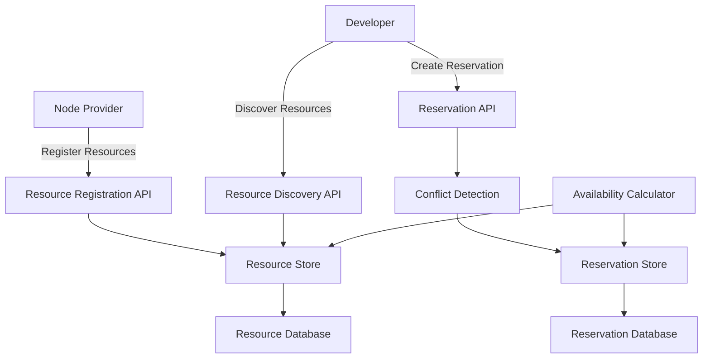
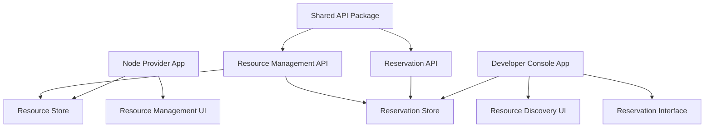

# Resource Management System Implementation Guide

This guide provides a comprehensive overview of implementing the resource management system across the cluster-apps monorepo, based on detailed analysis of the existing codebase and requirements.

## Executive Summary

The implementation adds compute resource management capabilities to the existing cluster-apps ecosystem, allowing node providers to register resources and developers to discover and reserve them. The system is designed to integrate seamlessly with the existing architecture while providing new functionality.

## Current State Analysis

### Existing Infrastructure ✅
- **Monorepo Structure**: npm workspaces with shared packages
- **Application Architecture**: Modular applications with routing
- **State Management**: MobX stores for reactive state
- **UI Framework**: Material-UI components with consistent theming
- **API Patterns**: Standardized API clients and error handling
- **Build System**: Vite for fast development and production builds

### Technology Stack Alignment ✅
- **TypeScript**: Strong typing throughout
- **React 18**: Modern React patterns
- **MobX**: Reactive state management
- **Material-UI**: Component library
- **Yup**: Schema validation
- **React Router**: Navigation

## Implementation Architecture

### Data Flow


### Component Architecture


## Task Implementation Analysis

### Why This Logical Order?

**1. API-First Approach**
- Backend capabilities must exist before UI can consume them
- Establishes data contracts early
- Enables parallel frontend development

**2. Dependency Chain**
- Resource Registration → Resource Reservation (data dependency)
- API Foundation → UI Implementation (technical dependency)
- Resource Management → Reservation Interface (user workflow dependency)

**3. Risk Mitigation**
- Core functionality implemented first
- UI built on stable API foundation
- Integration issues identified early

### Task Interconnections

#### Vertical Dependencies (Sequential)
```
Task 1 (Resource Registration) 
    ↓ [Provides resource data models]
Task 2 (Reservation System)
    ↓ [Provides complete API layer]
Task 3 (Resource Management UI)
    ↓ [Provides UI patterns & components]
Task 4 (Reservation Interface)
```

#### Horizontal Dependencies (Cross-App)
```
Node Provider App ←→ Developer Console App
    [Shared resource data through API layer]
    
Resource Store ←→ Reservation Store
    [State synchronization through shared API]
```

## Technical Implementation Details

### New Components Added

#### Shared API Package Extensions
```typescript
packages/api/src/ResourceManagementApi/
├── types.ts              // Resource & reservation models
├── validation.ts         // Yup validation schemas
├── conflictDetection.ts  // Conflict detection logic
├── ResourceApi.ts        // Resource CRUD operations
└── ReservationApi.ts     // Reservation management
```

#### Node Provider App Extensions
```typescript
apps/node-provider/src/
├── applications/ResourceManagement/    // New modular application
├── stores/ResourceStore/              // Resource state management
├── stores/ReservationStore/           // Reservation state management
└── api/mockResourceApi.ts             // Development mock API
```

#### Developer Console App Extensions
```typescript
apps/developer-console/src/
├── applications/ResourceReservation/  // New modular application
└── stores/                           // Extends AppStore with new stores
```

### Integration Points

#### State Management Integration
- **AppStore Pattern**: Both apps extend existing AppStore with new stores
- **MobX Reactivity**: Automatic UI updates on state changes
- **Cross-Store Communication**: Shared API layer enables data synchronization

#### UI Component Integration
- **Material-UI Consistency**: Uses established component patterns
- **Routing Integration**: New applications added to existing router configuration
- **Theme Alignment**: Consistent with existing visual design

#### API Integration
- **Shared Package**: Common API clients used by both applications
- **Error Handling**: Consistent error patterns across applications
- **Validation**: Shared validation logic ensures data consistency

## Development Workflow

### Phase 1: API Foundation (Tasks 1-2)
```bash
# 1. Extend shared API package
cd packages/api
npm install
# Implement resource and reservation APIs

# 2. Update Node Provider app
cd apps/node-provider  
npm install
# Add stores and mock API integration
```

### Phase 2: UI Implementation (Tasks 3-4)
```bash
# 3. Implement Node Provider UI
# Build resource management interface

# 4. Implement Developer Console UI  
cd apps/developer-console
# Add resource discovery and reservation interface
```

### Testing Strategy
```bash
# Unit tests for business logic
npm run test:unit

# Integration tests for API layer
npm run test:integration  

# E2E tests for complete workflows
npm run test:e2e
```

## Quality Assurance

### Code Quality Standards
- **TypeScript Strict Mode**: All code must compile without errors
- **ESLint Compliance**: Follow established linting rules
- **Test Coverage**: Minimum 80% coverage for business logic
- **Documentation**: All public APIs documented

### User Experience Standards
- **Responsive Design**: Works on desktop and tablet
- **Loading States**: Appropriate feedback during async operations
- **Error Handling**: Clear, actionable error messages
- **Accessibility**: WCAG 2.1 AA compliance

### Performance Standards
- **Bundle Size**: No significant increase in application bundles
- **API Response**: < 500ms for typical operations
- **UI Responsiveness**: < 100ms for user interactions

## Risk Analysis & Mitigation

### Technical Risks
1. **API Integration Complexity**
   - *Mitigation*: Mock API enables frontend development without backend dependency
   
2. **State Management Complexity**
   - *Mitigation*: Extends existing MobX patterns rather than introducing new patterns
   
3. **UI Component Conflicts**
   - *Mitigation*: Uses established Material-UI components and patterns

### Business Risks
1. **User Adoption**
   - *Mitigation*: Builds on familiar UI patterns from existing applications
   
2. **Feature Scope Creep**
   - *Mitigation*: Clear DoD criteria and phased implementation

## Success Metrics

### Technical Success
- [ ] All TypeScript compiles without errors
- [ ] Unit tests achieve >80% coverage
- [ ] Integration tests pass for all workflows
- [ ] Performance benchmarks met

### Functional Success
- [ ] Node providers can register resources
- [ ] Developers can discover and reserve resources
- [ ] System prevents conflicts and double-booking
- [ ] Real-time availability updates work correctly

### User Experience Success
- [ ] Intuitive workflow for both user types
- [ ] Clear error messages and recovery paths
- [ ] Responsive design across devices
- [ ] Consistent with existing application patterns

## Post-Implementation Considerations

### Monitoring & Analytics
- Track resource utilization rates
- Monitor reservation success/failure rates
- Analyze user engagement with new features

### Future Enhancements
- Advanced scheduling (recurring reservations)
- Resource performance metrics
- Cost management and billing integration
- Multi-tenant resource isolation

### Maintenance Plan
- Regular dependency updates
- Performance monitoring and optimization
- User feedback collection and iteration
- Documentation updates

## Conclusion

This implementation provides a solid foundation for resource management within the cluster-apps ecosystem. By building on existing architectural patterns and maintaining consistency with current applications, the system integrates seamlessly while providing powerful new capabilities.

The phased approach ensures that each component is thoroughly tested before moving to the next phase, reducing risk and enabling rapid iteration based on feedback.

For detailed implementation instructions, refer to the individual task directories:
- [Delivery Set 1: Core API Foundation](./delivery-set-1/)
- [Delivery Set 2: Demo UI Foundation](./delivery-set-2/) 