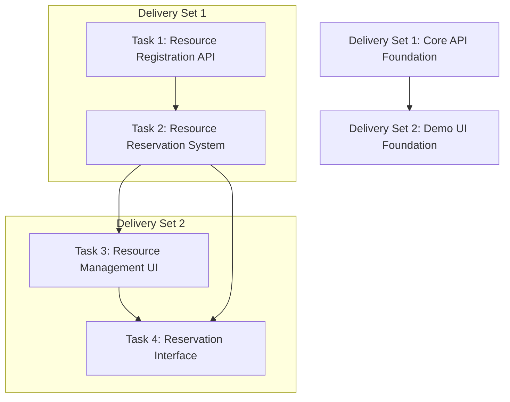

# Resource Management System Implementation Tasks

This directory contains detailed analysis and implementation plans for extending the Cluster Apps with compute resource management capabilities.

## Overview

The goal is to build a complete resource management system that allows:
1. **Node Providers** to register and manage their compute resources (GPU/CPU/RAM/HDD)
2. **Developers** to discover and reserve compute resources for their workloads
3. **System** to track availability, handle conflicts, and manage reservations

## Current State Analysis

### Node Provider App (`apps/node-provider`)
**Current Focus**: Node deployment and monitoring
- ✅ Node deployment automation via bootstrap script
- ✅ Monitoring integration with Grafana Agent
- ✅ Docker container orchestration
- ✅ Basic application structure with routing
- ✅ Store-based state management (MobX)

**Current Applications**:
- `NetworkTopology` - Network visualization
- `NodeConfigurationSteps` - Node setup workflow
- `Payouts` - Payment management

**Missing for Resource Management**:
- ❌ Resource registration system
- ❌ Resource specification models
- ❌ Availability tracking
- ❌ Reservation management
- ❌ API endpoints for resource operations

### Developer Console App (`apps/developer-console`)
**Current Focus**: DDC storage, content delivery, activity capture
- ✅ Modular application architecture
- ✅ DDC SDK integration
- ✅ Wallet integration
- ✅ User onboarding system

**Current Applications**:
- `ContentStorage` - File storage management
- `ContentDelivery` - CDN configuration
- `ActivityCapture` - Event tracking

**Missing for Resource Management**:
- ❌ Resource discovery interface
- ❌ Reservation booking system
- ❌ Resource availability visualization
- ❌ Integration with node provider resources

### Shared Infrastructure
**Available**:
- ✅ API package with standardized patterns
- ✅ UI package with Material-UI components
- ✅ Analytics and reporting utilities
- ✅ TypeScript configuration and standards

## Task Dependencies and Logical Flow



### Why This Order Matters

1. **API First Approach**: Backend capabilities must exist before UI can consume them
2. **Data Models Foundation**: Resource registration establishes the data structures needed for reservations
3. **State Management**: Reservation system builds on resource registry state
4. **UI Dependencies**: Management UI needs both registration and reservation APIs
5. **User Flow**: Reservation interface requires existing resource management for meaningful interactions

## Task Relationships

### Vertical Integration (Within Application)
- **Node Provider**: Resource Registration → Resource Management UI
- **Developer Console**: Resource Reservation API → Reservation Interface

### Horizontal Integration (Between Applications)
- **Data Sharing**: Node Provider registers resources → Developer Console consumes them
- **State Synchronization**: Reservations made in Developer Console → Availability updated in Node Provider
- **API Communication**: Both apps communicate through shared API layer

## Expected Outcomes

### After Delivery Set 1 (API Foundation)
- Node providers can register compute resources with specifications
- System can track resource availability in real-time
- Basic reservation API exists with conflict detection
- Foundation for UI development is established

### After Delivery Set 2 (UI Foundation) 
- Complete end-to-end resource management workflow
- Node providers can visually manage their resources
- Developers can discover and book available resources
- System provides feedback on reservation status and conflicts

## Architecture Impact

### New Components Being Added
```
apps/node-provider/
├── src/applications/ResourceManagement/     # New application
├── src/stores/ResourceStore/               # New store
└── src/api/ResourceApi/                    # New API layer

apps/developer-console/
├── src/applications/ResourceReservation/   # New application
└── src/stores/ReservationStore/           # New store

packages/api/src/
└── ResourceManagementApi/                 # New shared API
```

### Integration Points
- **Shared API Package**: Common resource models and API clients
- **UI Components**: Reusable resource cards, availability indicators
- **State Management**: Cross-application state synchronization
- **Type Definitions**: Shared TypeScript interfaces for resources

## Task Directory Structure

- [`delivery-set-1/`](./delivery-set-1/) - Core API Foundation
  - [`task-1-resource-registration/`](./delivery-set-1/task-1-resource-registration/) - Resource Registration Endpoint
  - [`task-2-reservation-system/`](./delivery-set-1/task-2-reservation-system/) - Resource Reservation System
- [`delivery-set-2/`](./delivery-set-2/) - Demo UI Foundation  
  - [`task-1-resource-management-ui/`](./delivery-set-2/task-1-resource-management-ui/) - Resource Management UI
  - [`task-2-reservation-interface/`](./delivery-set-2/task-2-reservation-interface/) - Basic Reservation Interface

## Success Criteria

### Technical Validation
- [ ] All TypeScript types compile without errors
- [ ] API endpoints respond with correct data structures
- [ ] UI components render properly across different screen sizes
- [ ] State management updates correctly across applications
- [ ] Integration tests pass for cross-app communication

### Functional Validation
- [ ] Node provider can register a VM with GPU/CPU/RAM/HDD specs
- [ ] System validates resource specifications appropriately
- [ ] Multiple users cannot reserve the same resource simultaneously
- [ ] UI shows real-time availability updates
- [ ] Developer can create and view their reservations

### User Experience Validation
- [ ] Workflow is intuitive for both node providers and developers
- [ ] Error messages are clear and actionable
- [ ] Loading states provide appropriate feedback
- [ ] Visual design is consistent with existing applications

## Next Steps

1. **Review Task Details**: Examine each task directory for detailed implementation plans
2. **Environment Setup**: Ensure development environment is configured per [Development Guide](../docs/development/guide.md)
3. **Start with Delivery Set 1**: Begin with API foundation before moving to UI
4. **Follow Coding Standards**: Adhere to established patterns from [Development Guide](../docs/development/guide.md)
5. **Test Incrementally**: Validate each task completion before proceeding to the next

For detailed implementation instructions, see individual task directories. 